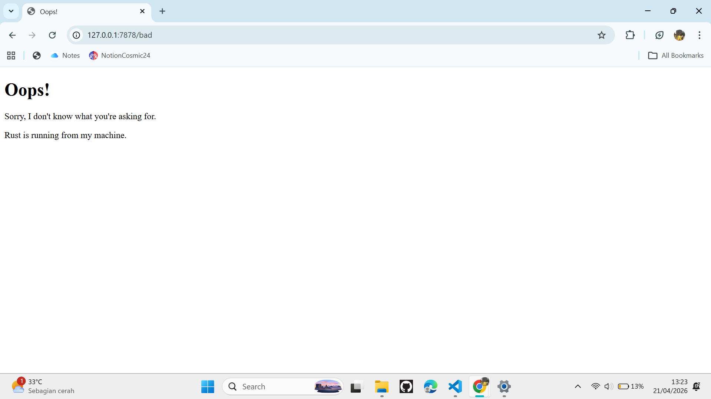

# Commit 1 Reflection Notes

## Handle-connection, check response

Pada milestone ini, saya mempelajari bagaimana server menerima dan membaca HTTP request 
dari browser menggunakan fungsi `handle_connection`.

Beberapa hal yang saya pelajari:

**`TcpListener`** digunakan untuk "mendengarkan" koneksi masuk pada alamat 
`127.0.0.1:7878`. Setiap kali ada koneksi masuk, stream-nya diproses oleh 
`handle_connection`.

**`BufReader`** membungkus TcpStream agar bisa dibaca baris per baris secara efisien. 
Tanpa BufReader, kita harus membaca byte satu per satu.

**HTTP Request Format** terdiri dari beberapa header yang diakhiri dengan blank line. 
Itulah mengapa `.take_while(|line| !line.is_empty())` digunakan — untuk berhenti 
membaca ketika menemukan baris kosong.

Dari output yang saya terima, browser mengirimkan informasi seperti:
- `GET / HTTP/1.1` — method, path, dan versi HTTP
- `Host` — alamat server yang dituju
- `User-Agent` — informasi browser yang digunakan
- `Accept` — format konten yang bisa diterima browser

Request muncul beberapa kali karena browser otomatis me-retry ketika tidak mendapat 
response dari server.

## Commit 2 Reflection Notes

### Returning HTML

Pada milestone ini, handle_connection dimodifikasi untuk mengirim HTTP response berisi file HTML.
`fs::read_to_string` digunakan untuk membaca isi file hello.html menjadi String.
HTTP response terdiri dari tiga bagian:
- Status line: `HTTP/1.1 200 OK`
- Header `Content-Length` yang berisi panjang konten HTML
- Blank line sebagai pemisah header dan body
- Body berisi isi HTML

Browser dapat merender halaman karena response sudah sesuai format protokol HTTP.

## Commit 3 Reflection Notes

### Validating request and selectively responding

Pada milestone ini, server sudah bisa membedakan request dan memberikan response yang sesuai.
Server membaca request line pertama dari HTTP request untuk mengetahui path yang diminta.
Jika path adalah `GET / HTTP/1.1`, server mengembalikan `hello.html` dengan status `200 OK`.
Jika path lain, server mengembalikan `404.html` dengan status `404 NOT FOUND`.
Refactoring dilakukan dengan menggunakan tuple `(status_line, filename)` agar tidak ada
duplikasi kode dalam membentuk response.

## Commit 4 Reflection Notes

### Simulation of slow request

Ketika mengakses `/sleep`, server akan tidur selama 10 detik sebelum merespons.
Karena server berjalan secara single-threaded, request lain (seperti `/`) harus
menunggu sampai request `/sleep` selesai diproses.
Ini menunjukkan kelemahan single-threaded server: satu request lambat bisa
memblokir semua request lainnya.